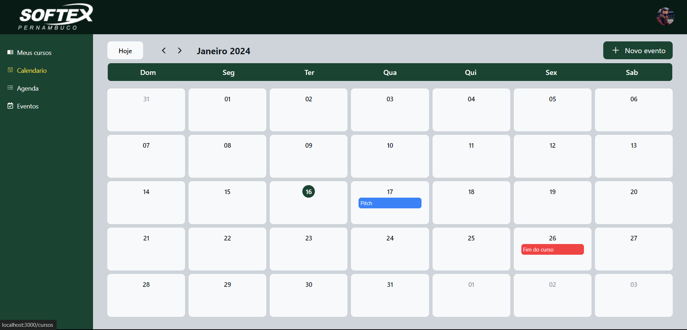

# TimeSync - Gerenciador de Tempo Inteligente

O projeto "TimeSync - Gerenciador de Tempo Inteligente" é uma plataforma web desenvolvida para auxiliar os usuários na organização eficiente de suas atividades do curso da FAP Softex.

## Screenshots

## Demonstração

[Video de Demonstração](https://drive.google.com/file/d/1Lf92PHIaiOVZC3YqciyEEMnWlPuSnrnG/view?usp=sharing)
## Stack utilizada

- NextJS
- React
- TypeScript
- TailwindCSS
- NextUI
- React Hook Form / Zod
- DayJs
